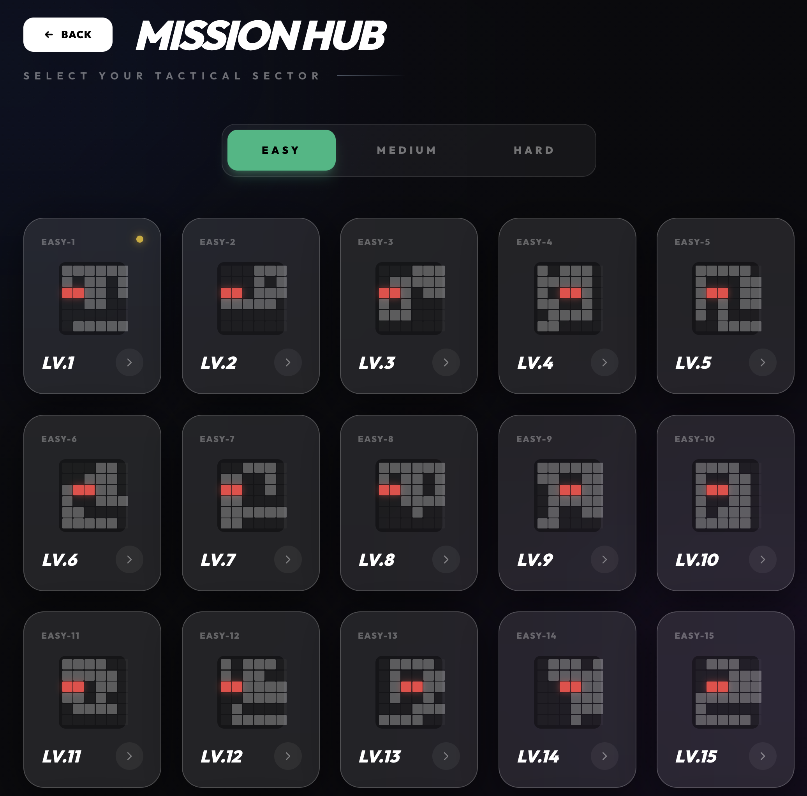
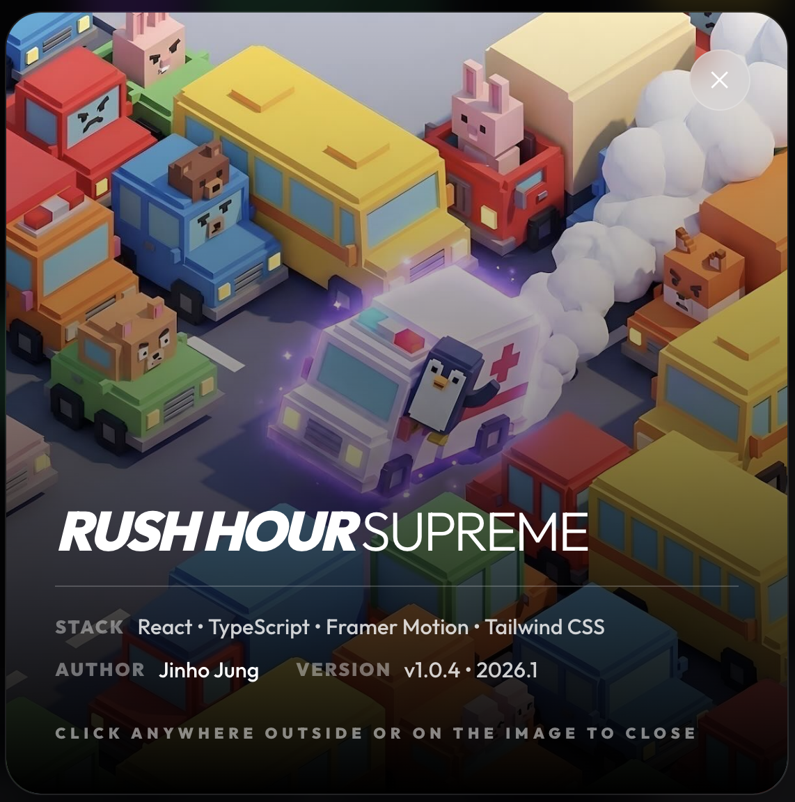

# 🚗 Rush Hour Supreme (러시아워 슈프림)

[](https://jvibeschool.org/RUSH/)
[](https://reactjs.org/)

> **"교통 체증을 뚫고 주인공 차량을 탈출시키세요!"**  
> 고전적인 퍼즐 게임의 매력을 현대적인 디자인과 부드러운 애니메이션으로 재해석한 **Rush Hour Supreme**입니다.

---

## 🔗 Live Demo
안드로이드, iOS 모바일 및 PC 브라우저에서 바로 플레이하실 수 있습니다.  
👉 **[https://jvibeschool.org/RUSH/](https://jvibeschool.org/RUSH/)**

---

## 📸 Screenshots
| | |
| :---: | :---: |
|  |  |
|  |  |

---

## 📖 게임의 유래 (Origins of Rush Hour)

러시아워(Rush Hour) 퍼즐은 1970년대 후반, 일본의 퍼즐 발명가 **노브 요시가하라(Nob Yoshigahara)**에 의해 고안되었습니다. 1996년 ThinkFun(당시 Binary Arts)사를 통해 공식 출시된 이후, 전 세계적으로 수백만 개가 판매되며 가장 사랑받는 슬라이딩 블록 퍼즐 중 하나가 되었습니다.

이 게임은 논리적 사고력과 공간 지각 능력을 기르는 데 탁월하며, 단순한 규칙 속에 깊이 있는 전략이 숨어 있어 모든 연령대에게 사랑받고 있습니다.

---

## ✨ 주요 특징 (Key Features)

- **현대적인 UI/UX**: 세련된 다크 모드 디자인과 유려한 인터페이스.
- **다양한 테마**: 아스팔트, 잔디, 스페이스, 사이버 등 10가지 이상의 배경 테마 제공.
- **다양한 주인공 차량**: F1 카, 경찰차, 소방차, 구급차는 물론 자전거와 카트까지 선택 가능.
- **지능형 힌트**: 막히는 구간에서 AI가 최적의 다음 수를 제시.
- **멀티 플랫폼 지원**: PC와 모바일 브라우저 어디서든 쾌적하게 플레이 가능.
- **다국어 지원**: 한국어와 영어를 모두 지원합니다.

---

## 🎮 게임 방법 (How to Play)

1. **목표**: 미로처럼 얽힌 차량들 사이를 뚫고 주인공 차량(Emoji)을 우측의 **비상구 아이콘**으로 탈출시키세요.
2. **조작**:
   - 차량을 **클릭**하여 선택합니다.
   - 키보드의 **방향키** 또는 화면에 나타나는 **화살표 버튼**을 이용해 차량을 앞뒤로 움직입니다.
3. **규칙**:
   - 수평으로 놓인 차량은 좌우로만 움직일 수 있습니다.
   - 수직으로 놓인 차량은 상하로만 움직일 수 있습니다.
   - 다른 차량이나 벽을 통과할 수 없습니다.

---

## 🛠️ 기술 스택 (Tech Stack)

- **Frontend**: React 18, TypeScript, Vite
- **Styling**: Tailwind CSS
- **Animation**: Framer Motion
- **Icons**: Lucide React
- **Hosting**: AWS (Ubuntu, Bitnami Apache)

---

## 🚀 시작하기 (Getting Started)

### 1. 프로젝트 복제
```bash
git clone https://github.com/jvisualschool/RushHour.git
cd RushHour/web
```

### 2. 의존성 설치
```bash
npm install
```

### 3. 로컬 실행
```bash
npm run dev
```

### 4. 빌드 및 배포
```bash
npm run build
```

---

## 👨‍💻 제작 및 관리 (Contact)

- **Creator**: [Jinho Jung](mailto:jvisualschool@gmail.com)
- **Email**: jvisualschool@gmail.com
- **Repository**: [https://github.com/jvisualschool/RushHour](https://github.com/jvisualschool/RushHour)

---

## 📜 라이선스 (License)

이 프로젝트는 개인 학습 및 교육용으로 제작되었습니다.

---
*Created with ❤️ by Jinho Jung*
